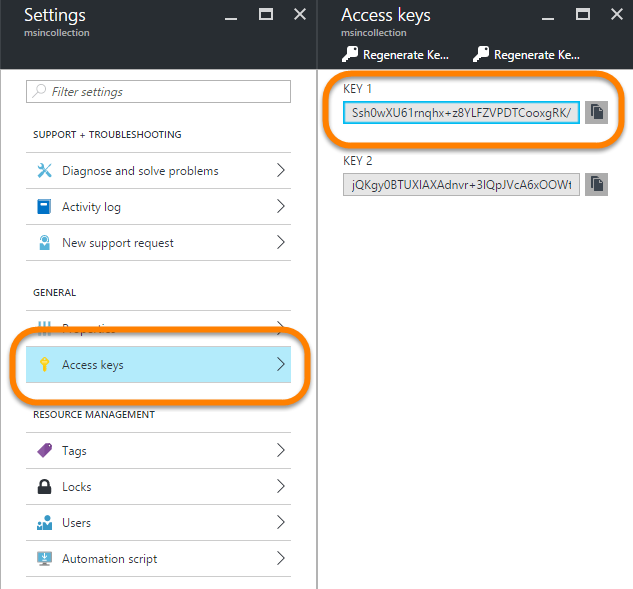

** Installing the PowerBI-cli **

The PowerBI-Cli is a node.js application.  You can find the source code for it here:

https://github.com/Microsoft/PowerBI-Cli

To install it, you need to have node.js installed, then you can use npm to install it:

```bash
npm install -g powerbi-cli
```

**Create a config in the working folder**.  
The config file is optional, but makes issuing multiple PowerBI commands from a folder much easier as it stores the common collection name, access key and even workspace id in a file for reuse accross multiple statements. Common paramters include:

```bash
-c, --collection
-k, --accessKey
-w, --workspace
-r, --report
```

When you create the config file, the options are saved in a 

`.powerbirc`

file in the folder where the command was run.  At the time of this writing, that file is not encrypted so be careful who you expose it to.  You can also effectively copy that to other folders to reuse.

```bash
powerbi config -c <collectioName> -k <accessKey>
```
        
You will need to first find your Power BI Workspace Collection name, and Access Key.




**Get the workspaces in a workspace collection**

```bash
# if you have already saved your collection name and 
# access key in the config file as above. you can simply type:
powerbi get-workspaces

# Otherwise, you will need to include the collection name
# and access key with the command
powerbi get-workspaces -c <collectionName> -k <accessKey>
```
once, you have retrieved the workspace id, you can add it to your config file if you like:

```bash
powerbi config -w <workspaceId>
```

** Importing a .pbix report **

First, you need to create a .pbix file using Power BI Desktop.  For PowerBI embedded you need to use the "Direct Query" option for your data if you want the report to be updated dynamicall.  Otherwise, you will need to re-upload the .pbix with fresh data each time you want to update it.

Here's a link to a video that explains it more (although I wish it was in more detail):

[Integrating Power BI into Your Own Applications – Featuring Real World Demos](https://azure.microsoft.com/en-us/documentation/videos/build-2016-integrating-power-bi-into-your-own-applications-featuring-real-world-demos/)  

In addition to the collection, access key, and workspace ID you will need two additional parameters, and a third optional one.

```bash
    powerbi import [options]

    -n, --displayName <displayName>  The dataset display name
    -f, --file <file>                The PBIX file to upload
    -o, --overwrite [overwrite]      Whether to overwrite a dataset with the same name.  Default is false
```

```bash
# if you have already saved your collection name, access key, 
# and workspace id in the config file as above. you can simply type:
powerbi import -n <what to call the report> -f <local path the to your .pbix file> -o 

# Otherwise, you will need to include the collection name
# and access key, and workspace id with the command
powerbi import -c <collectionName> -k <accessKey> -w <workspaceId> -n <what to call the report> -f <local path the to your .pbix file> -o 
```


** Get the reports in your workspace **

The reports are the report definitions you have imported from .pbix files.

```bash
# if you have already saved your collection name, access key, 
# and workspace id in the config file as above. you can simply type:
powerbi get-reports

# Otherwise, you will need to include the collection name
# and access key, and workspace id with the command
powerbi get-reports -c <collectionName> -k <accessKey> -w <workspaceId>
```

And yes, you can actually save the report to the config file as well if you want.  

** Get the datasets in your workspace **

When you upload a .pbix a report, and a datset is created.  To work with the datasets, like to update their connection information, you will need to know their IDs

```bash
# if you have already saved your collection name, access key, 
# and workspace id in the config file as above. you can simply type:
powerbi get-datasets

# Otherwise, you will need to include the collection name
# and access key, and workspace id with the command
powerbi get-datasets -c <collectionName> -k <accessKey> -w <workspaceId>
```


**Update the Connection Information for a dataset deployed in Power BI**

Using this command properly took some research on my part.  The format for the connection string was not well documented. I ended up finding it by looking up the documentation for the REST api call the cli was likely using:

[Post SetAllConnections REST API Documentation](https://msdn.microsoft.com/en-us/library/azure/mt711505.aspx)  

`powerbi update-connection --dataset "7c98eca7-1541-4eee-8b6d-a94ca5f63427" --username sqladmin --password "Pa`$`$w0rd" --connectionString "data source=msinsql.database.windows.net;initial catalog=msindb;persist security info=True;encrypt=True;trustservercertificate=False"`


**Update the Connection Information for a dataset deployed in Power BI**

`powerbi update-connection --dataset "7c98eca7-1541-4eee-8b6d-a94ca5f63427" --username sqladmin --password "Pa`$`$w0rd" --connectionString "data source=msinsql.database.windows.net;initial catalog=msindb;persist security info=True;encrypt=True;trustservercertificate=False"`


