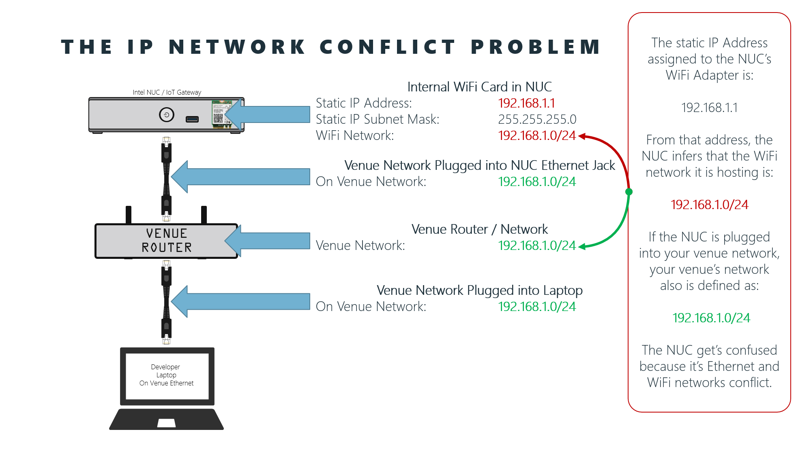
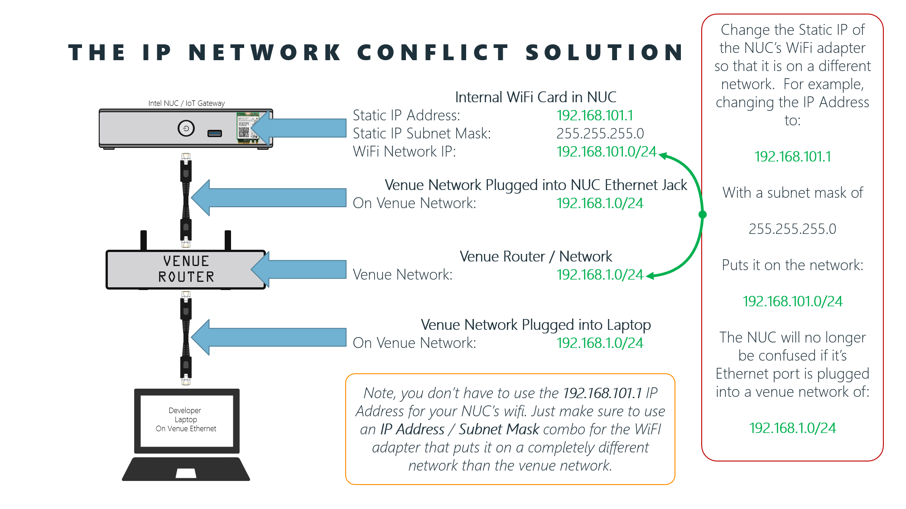
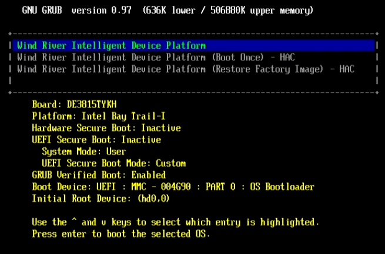
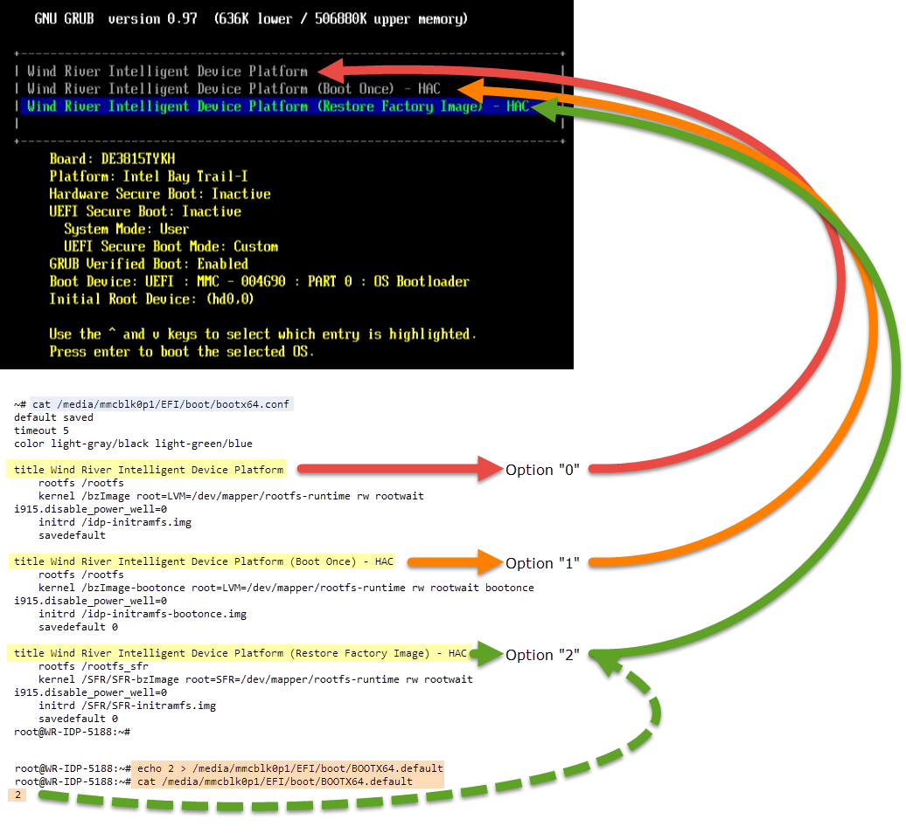

# Troubleshooting Steps and Fixes

- [Fixing the WiFi / Ethernet IP Address conflict on the NUC - The Easy Way](#networkconflict)
- [Re-imaging the NUC Locally](#reimaging)
- [Re-Imaging a NUC Remotely](#remotereimage)
- [Fixing Node-Red Flows](fixingflows)
- [Manual IoT_Cloud Repository And packagegroup-cloud-azure installs with RPM](#manualinstalls)
- [Manual Node-Red AzureIoTHub node installation using NPM instead of RPM](#manualnodered)
- [Showing All Repositories](#showrepos)
- [Re-adding Intel's Repo](#addintelrepo)
- [powerbi-cli Issues](#powerbicli)
- [IP Address not Displaying on the Grove LCD](#noiponlcd)


---

<a name="networkconflict"></a>

## Fixing the WiFi / Ethernet IP Address conflict on the NUC - The Easy Way:

### The problem

If you have a NUC with an internal WiFi card installed, the image on the NUC likely has that WiFi adapter's IP Address statically set as:


| IP Address    | Subnet Mask     |
| ------------- | --------------- |
| `192.168.1.1` | `255.255.255.0` |

The above IP Address / Subnet Mask implies tht the WiFi network the NUC hosts is:

`192.168.1.0/24`

That isn't a problem unless the Venue that you are at is also using the `192.168.1.0/24` network (a very common network for consumer routers to default to).  If the venue is using that network, and you connect the NUC's ethernet port to it, the NUC gets confused because it sees two separate `192.168.1.0/24` networks.  One on it's WiFi adapter and another on it's Ethernet adapter.



The easiest way to fix the problem is to simply re-assign the Static IP Address on the NUC's WiFi adapter so that it is on a different network:




The easiest way to resolve the problem is:

1. Connect an HDMI Monitor, Keyboard and Mouse directly to the NUC, and power the NUC up:

    

1. Using the keyboard, login to the NUC as the user `root` with the password `root`:

    ```bash
    WR-IDP-5188 login: root
    Password: root
    ```

4. From the command line, list the /etc/config/file:

    ```bash
    cat /etc/config/network
    ```

    Find the `lan` interface's `ipaddr` (IP Address) in the output (`192.168.1.1` below):

    ```bash
    ...

    config interface 'lan'
            option ifname 'wlan0'
            option type 'bridge'
            option proto 'static'
            option ipaddr '192.168.1.1'
            option netmask '255.255.255.0'

    ...
    ```
5. Decide on the new IP Address you wish to use.  We recommend using `192.168.101.1` and keeping the subnet mask at `255.255.255.0`.  This will put the NUC's WiFi adapter on the `192.168.101.0/24` network.  You can use whatever you wish, we'll assume the `192.168.101.1` network address.

6. If you are only changing the WiFi adapter's IP Address, and not it's subnet mask, you can do it easily using the `sed` (stream editor) utility.  Following is an example of changing the `192.168.1.1` ip address to `192.168.101.1`.

    > **Note**: We are using the Linux `sed` (Stream Editor) to make quick work of the editing, however if you have multiple changes to make, or prefer to use an editor, you can use the `vi` editor installed on the NUC or use `apt-get` to install another editor.  We won't document those steps here though.

    ```bash
    sudo sed -i 's/192.168.1.1/192.168.101.1/g' /etc/config/network
    ```

7. Verify the change by re-examining the /etc/config/network file:

    ```bash
    cat /etc/config/network
    ```

    With the output now showing the `192.168.101.1` as the `ipaddr`:

    ```bash
    ...

    config interface 'lan'
            option ifname 'wlan0'
            option type 'bridge'
            option proto 'static'
            option ipaddr '192.168.101.1'
            option netmask '255.255.255.0'

    ...
    ```

8. If everything looks good, reboot the NUC:

    ```bash
    sudo shutdown -r 0
    ```

9. Wait until it reboots, and verify that you can now connect to it over ethernet as expected. 

---

<a name="reimaging"></a>

## Re-imaging the NUC

The "**Intel IoT Gateway**" ships with a linux image already running on it.  There should also be a restorable factory image that can be used if you feel that your "**NUC**" is behaving poorly.  To do so, you'll need to have an HDMI Monitor and Keyboard attached to the NUC.  Here's how to do it:

Video: "**<a target="_blank" href="https://www.youtube.com/embed/nS6xNMGRRvg">Re-Imaging the Intel IoT Gateway NUC</a>**"

<iframe width="560" height="315" src="https://www.youtube.com/embed/nS6xNMGRRvg" frameborder="0" allowfullscreen></iframe> 

---

<a name="remotereimage"></a>

## Re-Imaging a NUC Remotely

These steps explain how to re-image a NUC from a remote machine.  This is handy in a lab environment where you need to reset a number of NUCs withouth having to connect a keyboard or screen to each one to reimage them locally.

<a name="remotereimagescript"></a>

### The Shell Script Method

This method requires that you have a bash prompt.  It should work on Linux or Mac, or if you are on Windows 10, you can install "[Bash on Ubuntu on Windows](https://msdn.microsoft.com/en-us/commandline/wsl/about)".  The shell script also helps clean up old ssh keys for the remote NUC given it's IP Address to prevent errors about the ssh key not being valid when you attempt to ssh back in after it is reimage.  It's just a much easier command to use when you have bunch of NUCs to reimage in a lab environment.

1. Open a bash prompt ***on your local computer*** (not on the NUC) and change into your home folder:

    ```bash
    cd ~
    ```

1. Download the `reimage.sh` script from GitHub using wget:

    ```
    wget -O reimage.sh https://github.com/dxcamps/MicrosoftIntelIoTCamp/raw/master/HOLs/Troubleshooting/scripts/reimage.sh
    ```

1. Enable execute permissions on the `reimage.sh` script

    ```bash
    chmod +x reimage.sh
    ```

1. You can now use the `reimage.sh` script to easily reimage a NUC if you know it's IP Address.  Replace `the.nucs.ip.address` below with the IP Address of the NUC you wish to reimage.  When prompted, enter `root` for the password on the remote NUC:

    > **Note**: Once the script has been downloaded and given execute permissions, you can run this statement repeatedly for each remote NUC IP Address to re-image all the NUCs in a room. Then walk the room and turn the all back on to get them re-image.

    ```bash
    ./reimage.sh the.nucs.ip.address
    ```

    For example, if my NUCs IP Address where `192.168.2.32` I would enter:

    ```bash
    ./reimage.sh 192.168.2.32
    ```

So what's different about the script as opposed to the "Basic" method described below?  Well the script:

- Attempts to clean up any old ssh keys for the NUC from your local `./ssh/known_hosts` file so you don't get errors when you ssh to the NUC after re-imaging because the key has changed.
- ssh's into the NUC and get's it to avoid prompting you to save the new key to known_hosts
- Makes it easier to reimage a bunch of machines by simplifying the command line for each one.

Here's the contents of the script:

```bash
#!/bin/bash

#Verify the IP Address of the remote NUC was passed in as an argument to the script
if [ $# -ne 1 ]; then
    echo $0: usage: reimage the.nucs.ip.address
    echo $0: for example:
    echo $0: reimage 192.168.2.32
    exit 1
fi

# Change into the current user's .ssh folder
pushd ~/.ssh

# Remove the old ssh key for the remote NUC host with the given ip address
ssh-keygen -f 'known_hosts' -R $1

# Change back to the previous working directory
popd

# ssh into the NUC given its IP Address.  
# -o "StrictHostKeyChecking no" -> Don't check for host keys in the known_hosts file 
# -o "UserKnownHostsFile=/dev/null" -> Points to a temporary null known_hosts file to keep the key from being stored
# "echo 2 > /media/mmcblk0p1/EFI/boot/BOOTX64.default" is executed on the NUC, and writes the value "2" to the BOOTX64.default file.  This means that option "2" (the third option, "Reset Factory Image option" on the boot menu) will be used by default.
# "shutdown -P 0" runs on the NUC and powers it down immediately
ssh -o "StrictHostKeyChecking no" -o "UserKnownHostsFile=/dev/null" root@$1 "echo 2 > /media/mmcblk0p1/EFI/boot/BOOTX64.default && shutdown -P 0"
```


<a name="remotereimagebasic"></a>

### The Basic Method

If you don't have a bash prompt (for example you want to run it from PowerShell instead), you can use the following command.  It's just a little more tedious than using the shell script , but it does exactly the same thing:

1. From a command prompt ***on your local computer*** where you have access to an ssh client, run the following command where `the.nucs.ip.address` is the IP Address of the remote NUC you wish to reimage and when prompted, enter `root` for the password:

    > **Note**: Read the "How does it work" section below to learn what the command is doing.

    ```bash
    ssh root@the.nucs.ip.address "echo 2 > /media/mmcblk0p1/EFI/boot/BOOTX64.default && shutdown -P 0"
    ```

    For example, if my NUCs IP Address were `192.186.2.32`, I would enter:

    ```bash
    ssh root@192.168.2.32 "echo 2 > /media/mmcblk0p1/EFI/boot/BOOTX64.default && shutdown -P 0"
    ```

    Lastly, if for some reason the NUC does NOT power down, try running the command again, or if you can't re-connect via ssh, then simply force the power off by holding the power button on the NUC in until it turns off.

1. If this is the first time you have ssh'd to the host, you may receive a prompt similar to the following.  If so, type **`yes`** and press `enter`.

    ```bash
    The authenticity of host '192.168.2.32 (192.168.2.32)' can't be established.
    ED25519 key fingerprint is ba:5c:59:3b:5d:45:6c:31:21:9c:71:fc:d2:80:b4:d0.
    Are you sure you want to continue connecting (yes/no)?
    ```

1. The remote NUC should power down automatically.  Once the NUC has powered down, press the Power Button on it to turn it back on. On the first boot it will automatically re-image itself. This will take 5-10 minutes to complete.  However, when it is done, you should see it's IP Address displayed on the Grove LCD Shield assuming you have it, the Grove Shield and the Arduino 101 connected to the NUC.

1. Once the NUC has re-imaged you can try to ssh back into it.  You may get an error that looks similar to the following:

    ```bash
    ~$ ssh root@192.168.2.32
    @@@@@@@@@@@@@@@@@@@@@@@@@@@@@@@@@@@@@@@@@@@@@@@@@@@@@@@@@@@
    @    WARNING: REMOTE HOST IDENTIFICATION HAS CHANGED!     @
    @@@@@@@@@@@@@@@@@@@@@@@@@@@@@@@@@@@@@@@@@@@@@@@@@@@@@@@@@@@
    IT IS POSSIBLE THAT SOMEONE IS DOING SOMETHING NASTY!
    Someone could be eavesdropping on you right now (man-in-the-middle attack)!
    It is also possible that a host key has just been changed.
    The fingerprint for the ED25519 key sent by the remote host is
    95:60:e4:13:a2:70:d5:a5:4a:17:45:25:ba:ed:48:ea.
    Please contact your system administrator.
    Add correct host key in /home/BretStateham/.ssh/known_hosts to get rid of this message.
    Offending ED25519 key in /home/BretStateham/.ssh/known_hosts:1
    remove with: ssh-keygen -f "/home/BretStateham/.ssh/known_hosts" -R 192.168.2.32
    ED25519 host key for 192.168.2.32 has changed and you have requested strict checking.
    Host key verification failed.
    ```

    If that happens, run the following command to remove the old ssh key for the host given it's ip address:

    ```bash
    cd ~
    ssh-keygen -f './.ssh/known_hosts' -R the.nucs.ip.address
    ```

    For example, with my NUCs IP Address of `192.169.2.32` I would enter:

    ```bash
    cd ~
    ssh-keygen -f './.ssh/known_hosts' -R 192.168.2.32
    ```

    Now, when I ssh in, I should be prompted to verify the connection and if I enter `yes` it will add they new key into the ./ssh/known_hosts file for me so I don't get prompted again in the future

    ```bash
    ~$ ssh root@192.168.2.32
    The authenticity of host '192.168.2.32 (192.168.2.32)' can't be established.
    ED25519 key fingerprint is 95:60:e4:13:a2:70:d5:a5:4a:17:45:25:ba:ed:48:ea.
    Are you sure you want to continue connecting (yes/no)? yes
    Warning: Permanently added '192.168.2.32' (ED25519) to the list of known hosts.
    Password: root
    root@WR-IDP-5188:~#
    ```

<a name="HowRemoteReimagingWorks"></a>

### How Remote Re-Imaging Works

The NUC uses GRUB 09.7 [link](https://www.gnu.org/software/grub/manual/legacy/grub.html) as it's bootloader.  The configuration file for the GRUB bootloaer for the NUC is at:

```bash
/media/mmcblk0p1/EFI/boot/bootx64.conf
```

If you were to look at the contents of that file, you'd see the following:

```bash
default saved
timeout 5
color light-gray/black light-green/blue

title Wind River Intelligent Device Platform
    rootfs /rootfs
    kernel /bzImage root=LVM=/dev/mapper/rootfs-runtime rw rootwait i915.disable_power_well=0
    initrd /idp-initramfs.img
    savedefault

title Wind River Intelligent Device Platform (Boot Once) - HAC
    rootfs /rootfs
    kernel /bzImage-bootonce root=LVM=/dev/mapper/rootfs-runtime rw rootwait bootonce i915.disable_power_well=0
    initrd /idp-initramfs-bootonce.img
    savedefault 0

title Wind River Intelligent Device Platform (Restore Factory Image) - HAC
    rootfs /rootfs_sfr
    kernel /SFR/SFR-bzImage root=SFR=/dev/mapper/rootfs-runtime rw rootwait i915.disable_power_well=0
    initrd /SFR/SFR-initramfs.img
    savedefault 0
```

The first two lines

```bash
default saved
timeout 5
```

That means that GRUB will wait 5 seconds (`timeout 5`) for the user to select an option before it looks in a previously saved default boot option number (`default saved`)  from a .default file (`/media/mmcblk0p1/EFI/boot/BOOTX64.default` in our case) and then automatically boot to that file.

There are three boot options (numbered sequentially starting with 0):

```bash
...
title Wind River Intelligent Device Platform
...
title Wind River Intelligent Device Platform (Boot Once) - HAC
...
title Wind River Intelligent Device Platform (Restore Factory Image) - HAC
...
```

The options are numbered starting with 0:

- 0 = `Wind River Intelligent Device Platform`
- 1 = `Wind River Intelligent Device Platform (Boot Once) - HAC`
- 2 = `Wind River Intelligent Device Platform (Restore Factory Image) - HAC`

You can see three different boot options when the NUC boots if you have a monitor attached to the NUC. If you had a keyboard, you could then manually select the third option (Option 2), "Wind River Intelligent Device Platform (Restore Factory Image) - HAC" to re-image the NUC on reboot.




The configuration of the first option, `Wind River Intelligent Device Platform`, ends with the command `savedefault`:

```bash
...
title Wind River Intelligent Device Platform
    rootfs /rootfs
    kernel /bzImage root=LVM=/dev/mapper/rootfs-runtime rw rootwait i915.disable_power_well=0
    initrd /idp-initramfs.img
    savedefault
...
```

That means that if that option is selected at boot, it's number, 0, will be written to the `/media/mmcblk0p1/EFI/boot/BOOTX64.default` file for use by the `default saved` option on the next boot.

The other two options both end with :

```bash
    savedefault 0
```

This means that even if you boot to one of those options, they will still save boot option 0 (the first one) to the `/media/mmcblk0p1/EFI/boot/BOOTX64.default` file as the deafult for the next boot.

So, that means that we can override that default option then by simply replacing the contents of the `/media/mmcblk0p1/EFI/boot/BOOTX64.default` file with the number of the option we want to be used on the next boot.  To have the NUC reimage, we want it to boot to option 2 on the next boot.

The ssh command we use above (whether manually or from the reimage.sh shell script) is:

```bash
ssh root@the.nucs.ip.address "echo 2 > /media/mmcblk0p1/EFI/boot/BOOTX64.default && shutdown -P 0"
```

It passes two different commands to the remote NUC.  The first command is:

```bash
echo 2 > /media/mmcblk0p1/EFI/boot/BOOTX64.default
```

That command replaces the contents of the `/media/mmcblk0p1/EFI/boot/BOOTX64.default` file on the NUC with the value `2` which means the third boot option, `Wind River Intelligent Device Platform (Restore Factory Image) - HAC`, will be used by default on the next boot.

A second command is then run to shutdown the NUC:

```bash
shutdown -P 0
```

Now when you power the NUC back up:

1. The NUC will wait for the 5 second timeout
1. When the timeout expires, the value 2 will be read from `/media/mmcblk0p1/EFI/boot/BOOTX64.default` and the  `Wind River Intelligent Device Platform (Restore Factory Image) - HAC` option will be selected by default
1. The NUC will be re-imaged (takes 5-10 minutes).
1. The value 0 will be saved to the `/media/mmcblk0p1/EFI/boot/BOOTX64.default` file and the NUC will reboot
1. The NUC will wait for the 5 second timeout
1. When the timeout expires, the value 0 will be read from freshly re-imaged  `/media/mmcblk0p1/EFI/boot/BOOTX64.default` and the  `Wind River Intelligent Device Platform` option will be selected
1. The NUC will boot normally to a newly refreshed image.  You can now login with the `root` user name and the `root` password.





---

<a name="fixingflows"></a>

## Fixing Node-Red Flows

If you've messed up the "**Flow 1**", "**Blinky**" for "**Flow 3**" (Azure) flows you can import versions of the flows from the **"/Node-RED Flows**" files.  

---

<a name="manualinstalls"></a>

## Manual IoT_Cloud Repository And packagegroup-cloud-azure installs with RPM

ssh into the NUC and run the following commands:

```text
rpm --import http://iotdk.intel.com/misc/iot_pub.key
rpm --import http://iotdk.intel.com/misc/iot_pub2.key
npm install node-red-contrib-os -g
smart channel --add 'IoT_Cloud' type=rpm-md baseurl=http://iotdk.intel.com/repos/iot-cloud/wrlinux7/rcpl13 -y
smart update 'IoT_Cloud'
smart update
smart install -y packagegroup-cloud-azure
systemctl restart node-red-experience
```

---

<a name="manualnodered"></a>

## Manual Node-Red AzureIoTHub node installation using NPM instead of RPM

ssh into the NUC and run the following commands:

> **Note**: Make sure to include the `@0.0.1` version specifier on the `node-red-contrib-azureiothubnode` installation.  That will make sure that you install the version this lab was documented against. 

```text
rpm --import http://iotdk.intel.com/misc/iot_pub.key
npm install node-red-contrib-os -g
npm install -g node-red-contrib-azureiothubnode@0.0.1
systemctl restart node-red-experience
```

---

<a name="showrepos"></a>

## Show All Repositories

In case you need to look at the repos that have been added to the IoT Gateway, execute the following:

```bash
smart channel --show
```

---

<a name="addintelrepo"></a>

## Re-adding Intel's Repo

In case you accidentally delete the Intel package repository, the information is the following:

```text
Name: Intel_Repository
Url: https://download.01.org/iotgateway/rcpl13/x86_64
```

---

<a name="powerbicli"></a>

## powerbi-cli Issues

The powerbi-cli command line tool has had some issues lately.

### Issues on Linux, OSX, and Bash on Ubuntu on Windows

The cli has some installation issues it seems in linux environments.  The powerbi-cli team is aware of them, but they does not appear to have been resolved yet.

For example, when you run:

`powerbi config`

You may receive an error like:

`powerbi-config(1) does not exist, try --help`

The problem appears to be related to how the client finds it's submodules.  As a workaround, you can attempt the steps documented on the powerbi-cli's github Issues page: [Microsoft/PowerBI-Cli#5 (comment)](https://github.com/Microsoft/PowerBI-Cli/issues/5#issuecomment-251419579)

### Issues Updating the Database Connection String

The `powerbi update-connection` command was broken in some recent versions of the powerbi-cli.

The command would return results like the following:

```
[ powerbi ] Found dataset!
[ powerbi ] Id: 1667a811-f8bb-4792-a719-07adc5d244e2
[ powerbi ] Name: TempChart
[ powerbi ] Updating connection string...
[ powerbi ] parameters[valueElement] must be of type object.
[ powerbi ] Connection string successfully updated

...

[ powerbi ] Successfully updated datasource credentials!
[ powerbi ] Datasource ID:  9dc4fe4d-d620-4910-a069-6c20e0b8837a
[ powerbi ] Gateway ID:  627fa205-99de-4f50-aaf8-484838be30f6
```

Even though it LOOKS like it updated there is one line in the output that reads:

```bash
[ powerbi ] parameters[valueElement] must be of type object.
```

That is actually an error, and you will find that the connection string didn't actually update.  To fix the problem, make sure you are running powerbi-cli version 1.0.8 or later.

***Even if you already have v1.0.8 installed you should RE-INSTALL to make sure you have the latest bits.  The team make some fixes, but they were re-released on the same version number***

1. To check the version of the powerbi-cli you can run the following command:

    ```bash
    powerbi --version
    ```

    Make sure you get v1.0.8 or later as a result:

    ```bash
    1.0.8
    ```

1. To re-install to the latest version of the powerbi-cli:

    ```bash
    npm insatll -g powerbi-cli
    ```

---

<a name="noiponlcd"></a>

## IP Address not Displaying on the Grove LCD

When you boot, the NUC with the Arduino 101, Grove Shield, Rotary Sesor, LCD and Ethernet attached you should see your NUC's IP Address display on the LCD. This is because the default Node-Red Flow on the NUC is reading the IP Address off of the `eth0` (Ethernet) interface, and displaying it on the LCD for you.  However, if you are NOT seeing the IP Address display check the following:

1. First, ensure that the Arduino 101, Grove Shield, Rotary Sensor and LCD were assembled correctly as documented in the lab in int [Getting Started with Grove IoT Commercial Developer Kit](../readme.md#GettingStartedWithGrove) section.

1. Ensure that you set the voltage switch on the Grove Shield as documented in the lab:

    

1. Make sure that the Arduino 101 is connected to the NUC's USB port ***BEFORE*** you power the NUC on to boot it.  

    > **Note**: Why?  The NUC communicates with the Arduino 101 using a serial communication framework called "Firmata".  When the NUC boots, it checks to see if it has an Arduino 101 installed and if it does, it flashes the Arduino 101 with the Firmata firmware.  If you attache the Arduino 101 AFTER the NUC has booted, it may not have received the Firmata firmware.

1. One way to test that the Firmata is working, etc. is to twist the rotary sensor.  You should see that the background color of the RGB LCD attached to the Grove Shield changes.  This is implemented in the default Node-Red flow on the NUC and it wouldn't work if the NUC couldn't communicate with the Arduino 101.  So if that works, at least you know the NUC / Node-Red / Arduino 101 / Grove Shield stack is working.  

1. You should also be able to see the current values of the rotary sensor in the Intel Dev Hub on the NUC at `http://<your.nucs.ip.address>`.  Again, this is just to help you confirm that the communication between your NUC and the Arduino 101 is working so you can continue to diagnose the issue of the IP Address not displaying.

