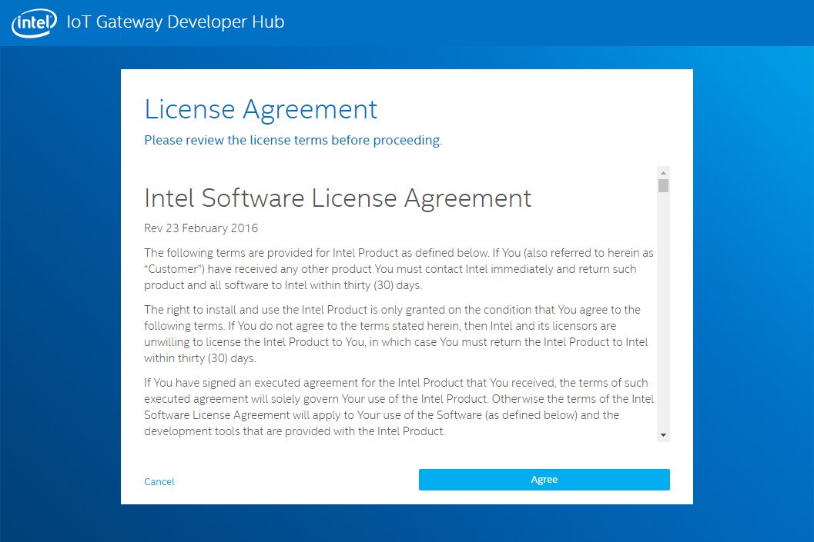

Intel IoT Gateway, Arduino 101 and Microsoft Azure Hands-On-Lab
===

Overview
---

In this lab, we will unbox and set up an Intel IoT Gateway and the Arduino 101 board (with a Grove Starter kit) along with several services available in Microsoft Azure to monitor the temperature and alert maintenance of a high temperature. Using Node-RED, running on the Intel NUC Gateway, the application will read the temperature value from a Grove temperature sensor and publish that data to an Azure IoT Hub.  From there a collection of Azure services including Stream Analytics, Event Hubs, SQL Database, Web Applications and Power BI Embedded will be used to both display the temperature data as well as alert the user to temperature readings over a certain threshold. 


Prerequisites
---

In order to successfully complete this lab you will ned:

- Intel Grove Commercial IoT Developer Kit [link](https://www.seeedstudio.com/Grove-IoT-Commercial-Developer-Kit-p-2665.html)
- Arduino 101 [link](https://www.arduino.cc/en/Main/ArduinoBoard101)
- A computer.  Windows, Mac OSx or Linux
- An active Microsoft Azure Subscription [free trial](https://azure.microsoft.com/en-us/free/)

Tasks
---

1. [Getting Started with Grove IoT Commercial Developer Kit](#GettingStartedWithGrove)
1. [Intel NUC Developer Hub Overview](#IntelNucHubOverview)
1. [Starting Node-RED for Blinky LED](#Blinky)
1. [Reading the Temperature Sensor](#ReadingTemperatures)
1. [Creating an Azure IoT Hub and Device](#CreateIoTHubAndDevice)
1. [Publishing Temperature Sensor Data to the Azure IoT Hub](#PublishToIoTHub)
1. [Processing Temperature Data with Stream Analytics](#ProcessingWithStreamAnalytics)
1. [Displaying Temperature Data with Azure Web Apps](#AzureWebApp)
1. [Sending Messages from the Azure IoT Hub to the Intel Gateway](#CloudToDeviceMessages)
1. [TIME PERMITTING - Display Temperature Data with Power BI Embedded](#PowerBIEmbedded)

___

<a name="TaskName"></a>
TASK NAME
---

1. Do this

    ````javascript
     var sample = 'with some code';
     console.log(sample);
    ````

1. Show some screenshot:

    

1. Do something else

    > **Note!**: This is a sample note!

    - With one
    - or two
    - substeps

___

<a name="TaskName"></a>
TASK NAME
---

1. Do this

    ````javascript
     var sample = 'with some code';
     console.log(sample);
    ````

1. Show some screenshot:

    

1. Do something else

    > **Note!**: This is a sample note!

    - With one
    - or two
    - substeps

___

<a name="TaskName"></a>
TASK NAME
---

1. Do this

    ````javascript
     var sample = 'with some code';
     console.log(sample);
    ````

1. Show some screenshot:

    

1. Do something else

    > **Note!**: This is a sample note!

    - With one
    - or two
    - substeps

___

<a name="TaskName"></a>
TASK NAME
---

1. Do this

    ````javascript
     var sample = 'with some code';
     console.log(sample);
    ````

1. Show some screenshot:

    

1. Do something else

    > **Note!**: This is a sample note!

    - With one
    - or two
    - substeps

___

<a name="TaskName"></a>
TASK NAME
---

1. Do this

    ````javascript
     var sample = 'with some code';
     console.log(sample);
    ````

1. Show some screenshot:

    

1. Do something else

    > **Note!**: This is a sample note!

    - With one
    - or two
    - substeps

___

<a name="TaskName"></a>
TASK NAME
---

1. Do this

    ````javascript
     var sample = 'with some code';
     console.log(sample);
    ````

1. Show some screenshot:

    

1. Do something else

    > **Note!**: This is a sample note!

    - With one
    - or two
    - substeps

___

<a name="TaskName"></a>
TASK NAME
---

1. Do this

    ````javascript
     var sample = 'with some code';
     console.log(sample);
    ````

1. Show some screenshot:

    

1. Do something else

    > **Note!**: This is a sample note!

    - With one
    - or two
    - substeps

___

<a name="TaskName"></a>
TASK NAME
---

1. Do this

    ````javascript
     var sample = 'with some code';
     console.log(sample);
    ````

1. Show some screenshot:

    

1. Do something else

    > **Note!**: This is a sample note!

    - With one
    - or two
    - substeps

___

<a name="TaskName"></a>
TASK NAME
---

1. Do this

    ````javascript
     var sample = 'with some code';
     console.log(sample);
    ````

1. Show some screenshot:

    

1. Do something else

    > **Note!**: This is a sample note!

    - With one
    - or two
    - substeps

___

<a name="TaskName"></a>
TASK NAME
---

1. Do this

    ````javascript
     var sample = 'with some code';
     console.log(sample);
    ````

1. Show some screenshot:

    

1. Do something else

    > **Note!**: This is a sample note!

    - With one
    - or two
    - substeps

___

<a name="TaskName"></a>
TASK NAME
---

1. Do this

    ````javascript
     var sample = 'with some code';
     console.log(sample);
    ````

1. Show some screenshot:

    

1. Do something else

    > **Note!**: This is a sample note!

    - With one
    - or two
    - substeps
